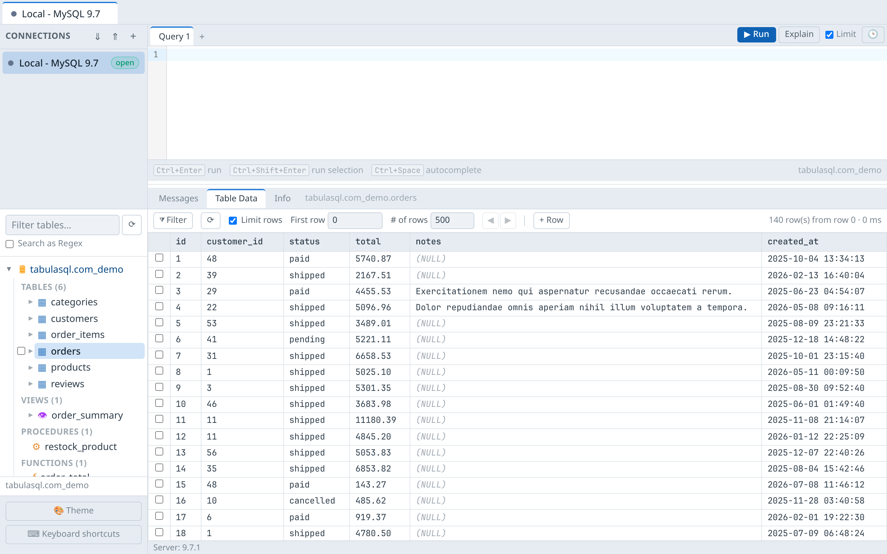
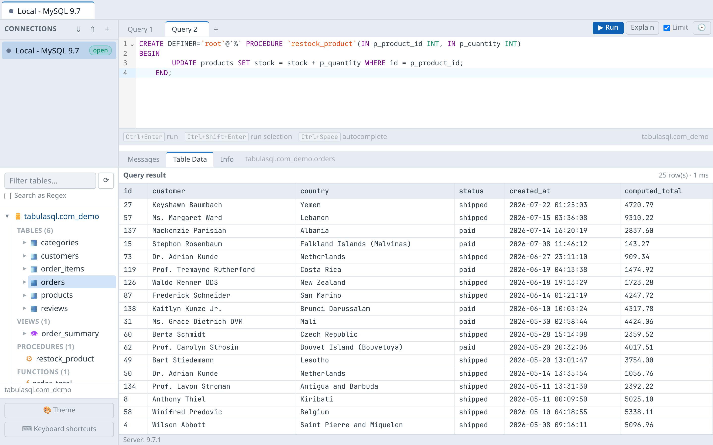
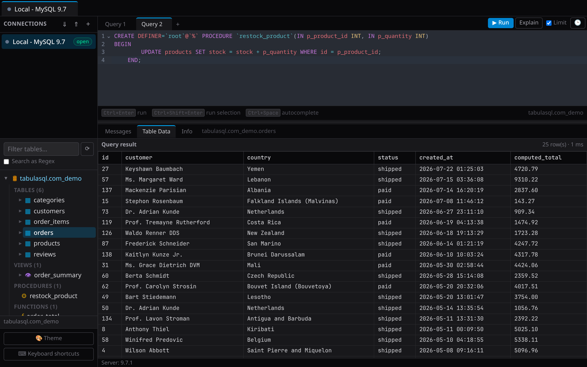
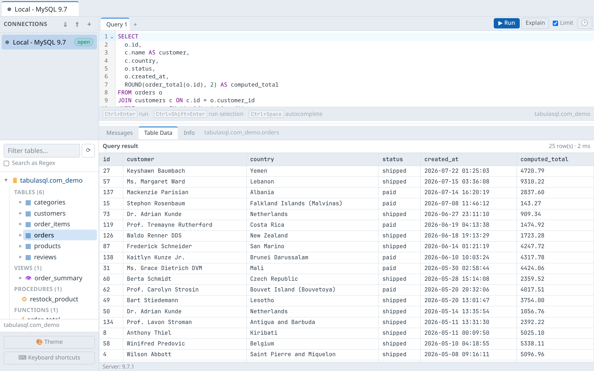
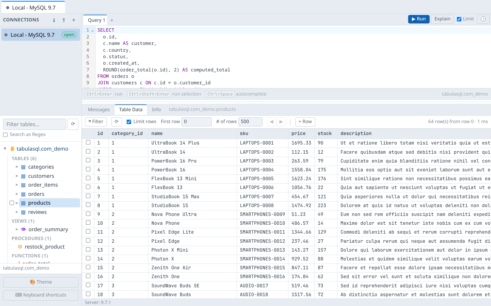

# TabulaSQL

A fast, free MySQL/MariaDB desktop client for Linux, Windows and macOS,
built with Laravel, Livewire and NativePHP.

Website: [tabulasql.com](https://tabulasql.com)

## Screenshots

<p align="center">
  
</p>

<p align="center">
  
  &nbsp;
  
</p>

<p align="center">
  
  &nbsp;
  
</p>

## Features

- **Connections**: saved connections with colors, encrypted passwords,
  test-before-save, SSH tunneling (key or password auth via `sshpass`),
  encrypted `.dbmconn` export/import to share connections between machines
- **Object explorer**: databases with tables/views with row counts,
  lazy-loaded columns and indexes, live filter with optional regex
- **Query editor**: CodeMirror 6 with schema-aware autocompletion, multiple
  query tabs, multi-statement execution, optional `LIMIT` injection on
  unlimited SELECTs, EXPLAIN, searchable per-connection query history
- **Data grid**: paging, sorting, custom filters (with SQL preview and
  removable chips), quick filters, inline editing (double-click; date/enum
  aware inputs), insert/duplicate/delete rows, Set To NULL/Empty/Default,
  NULL and blob/long-text rendering with a text/hex viewer
- **Relations**: foreign key drill-down (real constraints *and* Laravel-style
  `xxx_id` convention matches) with nested record navigation
- **Schema management**: create table dialog, index manager, foreign key
  manager, alter via DDL in the editor, SQL statement templates
- **Copy & backup**: copy tables/views between connections (chunked, FK-safe,
  live progress), pure-PHP SQL dumps (no `mysqldump` needed), SQL import with
  per-statement error reporting, resultset export to CSV/JSON/SQL
- **Comfort**: light/dark/auto theme, context menus everywhere, keyboard
  shortcuts, session restore, dense layout with draggable splitters

## Requirements

- PHP 8.4.1+ with `pdo_mysql`, `sqlite3` and `sodium`
- Node.js 20+
- MySQL 5.7+ / MariaDB 10.4+ targets
- `ssh` (and optionally `sshpass`) for SSH tunneling

## Development

```bash
composer install
npm install
cp .env.example .env
php artisan key:generate
php artisan migrate
npm run build          # or: npm run dev
composer native:dev    # desktop app (or: php artisan serve for browser-only)
```

### Tests

```bash
./vendor/bin/pest
```

Integration tests run against a disposable MariaDB container and skip
automatically when it is not available:

```bash
docker run -d --name dbmanager-test -e MARIADB_ROOT_PASSWORD=secret \
  -p 33061:3306 mariadb:11
```

## Acknowledgements

Big thanks to [Tilto](https://github.com/businesstilto) for testing TabulaSQL and providing a lot of valuable feedback.

## Building releases

See [docs/BUILDING.md](docs/BUILDING.md).

## License

[MIT](LICENSE)
